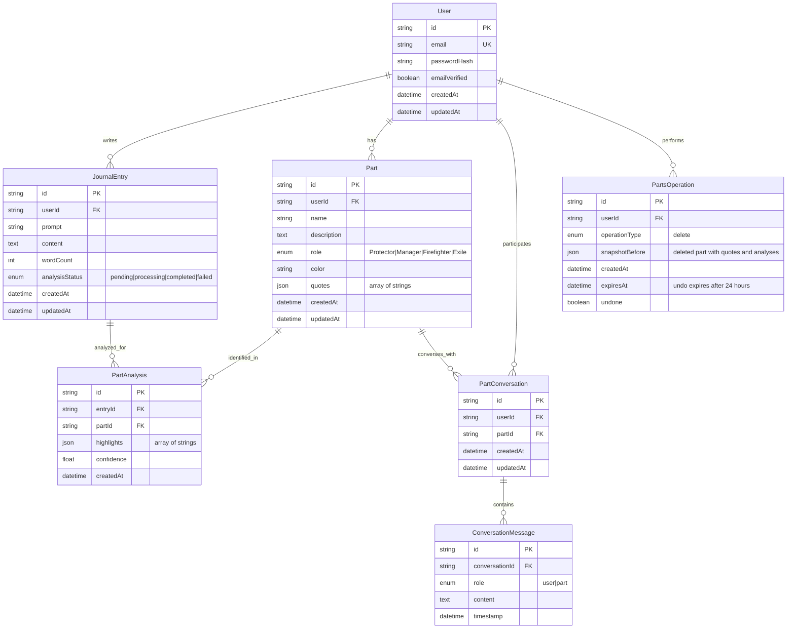

# IFS Journal App - Design Document

## Overview

The IFS Journal App is a web application built with modern web technologies to provide a secure, scalable, and therapeutic journaling experience. The architecture prioritizes user privacy, performance, and therapeutic effectiveness while supporting multiple users with complete data isolation.

## Architecture

### High-Level Architecture

```
┌─────────────────────────────────────────────┐    ┌─────────────────┐
│         Next.js 15 Full-Stack App           │    │   External APIs │
│                                             │    │                 │
│  ┌──────────────┐    ┌──────────────────┐  │    │ • OpenAI GPT-4.5│
│  │   Frontend   │    │   API Routes     │  │◄──►│ • Email Service │
│  │              │    │                  │  │    │                 │
│  │ • React      │◄──►│ • Serverless API │  │    └─────────────────┘
│  │ • TypeScript │    │ • PostgreSQL     │  │
│  │ • Tailwind   │    │ • Redis Cache    │  │
│  │ • PWA        │    │ • Prisma ORM     │  │
│  └──────────────┘    └──────────────────┘  │
└─────────────────────────────────────────────┘
```

### Technology Stack

**Frontend:**
- **Next.js 15** with App Router for full-stack React framework with SSR/SSG capabilities
- **TypeScript 5.6+** for type safety and better developer experience
- **Biome.js** for ultra-fast linting, formatting, and code quality
- **Tailwind CSS 4.1** with custom design system for distinctive, clean styling
- **Framer Motion** for subtle, therapeutic animations
- **Chart.js** for bar charts
- **Web Speech API** for free speech-to-text functionality (hidden in unsupported browsers)
- **React Hook Form + Zod** for form management and validation
- **Zustand** for lightweight state management
- **Next.js built-in routing** with App Router for file-based routing
- **TanStack Query** for server state management and caching
- **Standard web app** (PWA deferred to post-MVP)
- **Jest + React Testing Library** for unit testing
- **Playwright** for E2E testing

**Backend (Next.js API Routes):**
- **Next.js 15 API Routes** for serverless REST API endpoints
- **TypeScript** for consistent type safety across the stack
- **Neon PostgreSQL** for serverless database with branching
  - **Development:** Neon development branch
  - **Production:** Neon production branch
- **Prisma ORM** for type-safe database operations and migrations
- **Zod** for runtime validation and type safety
- **Next.js middleware** for request handling and security

**External Services:**
- **OpenAI GPT-4.5 (o1)** for all AI interactions (prompt generation, parts analysis, conversations, writing tips)
- **Vercel** for full-stack deployment (Next.js app + API routes)
- **Neon** for serverless PostgreSQL database with branching

**Development Environment:**
- **Neon PostgreSQL** with database branching
  - Development branch for development
  - Production branch for production
- **Prisma Migrate** for database schema management
- **Prisma Seed** for test data generation
  - 2 test users with realistic data
  - 10 journal entries spanning 2 weeks
  - 4 discovered parts (one of each type) with quotes and analyses
  - 1 parts operation for delete undo testing
- **Environment Variables:**
  - `DATABASE_URL` - Neon connection string (different for each branch)
  - `NEXTAUTH_SECRET` - Auth secret
  - `NEXTAUTH_URL` - App URL (http://localhost:3000 for dev)
  - `OPENAI_API_KEY` - OpenAI API key
  - `NODE_ENV` - development/production

**DevOps & Deployment:**
- **GitHub Actions** for CI/CD
- **Vercel** for zero-downtime deployments
- **Database migrations** with Prisma for schema evolution
- **Sentry** for error tracking and performance monitoring (optional)

## Data Models

### Entity Relationship Diagram



### Database Indexes

```sql
-- Performance indexes
CREATE INDEX idx_journal_entries_user_created ON journal_entries(user_id, created_at DESC);
CREATE INDEX idx_parts_user_id ON parts(user_id);
CREATE INDEX idx_part_analysis_entry_id ON part_analysis(entry_id);
CREATE INDEX idx_part_analysis_part_id ON part_analysis(part_id);
CREATE INDEX idx_conversation_messages_conversation ON conversation_messages(conversation_id, timestamp);
CREATE INDEX idx_parts_operations_user_expires ON parts_operations(user_id, expires_at) WHERE undone = false;

-- Unique constraints
CREATE UNIQUE INDEX idx_users_email ON users(email) WHERE deleted_at IS NULL;
```

### Core Entities

```typescript
// User Management
interface User {
  id: string
  email: string
  passwordHash: string
  createdAt: Date
  updatedAt: Date
  emailVerified: boolean
}

// Journaling
interface JournalEntry {
  id: string
  userId: string
  prompt: string
  content: string
  wordCount: number
  analysisStatus: 'pending' | 'processing' | 'completed' | 'failed'
  createdAt: Date
  updatedAt: Date
}

// Parts System
interface Part {
  id: string
  userId: string
  name: string
  description: string
  role: 'Protector' | 'Manager' | 'Firefighter' | 'Exile'
  color: string // Hex color for UI consistency
  quotes: string[] // Complete sentences expressing this part's voice
  createdAt: Date
  updatedAt: Date
}

interface PartAnalysis {
  id: string
  entryId: string
  partId: string
  highlights: string[] // Complete sentences or meaningful phrases to highlight
  confidence: number // AI confidence score
  createdAt: Date
}

// Conversations
interface PartConversation {
  id: string
  userId: string
  partId: string
  messages: ConversationMessage[]
  createdAt: Date
  updatedAt: Date
}

interface ConversationMessage {
  id: string
  role: 'user' | 'part'
  content: string
  timestamp: Date
}

// Parts Operations (for delete undo functionality)
interface PartsOperation {
  id: string
  userId: string
  operationType: 'delete'
  snapshotBefore: DeletedPartSnapshot // Deleted part with all data
  createdAt: Date
  expiresAt: Date // Undo expires after 24 hours
  undone: boolean
}

interface DeletedPartSnapshot {
  part: Part // The deleted part
  partAnalyses: PartAnalysis[] // All analyses for this part
}
```

## UI/UX Design System

### Visual Identity
- **Clean, distinctive aesthetic** that avoids generic Bootstrap patterns
- **Therapeutic color palette** with soft, muted tones that feel safe and calming
- **Custom typography** using Inter or similar rounded sans-serif for warmth
- **Organic shapes** with consistent 12px border radius and subtle shadows
- **Generous whitespace** (24px+ margins) for breathing room and focus

### Color System
```css
/* Primary therapeutic palette */
--primary: #6366f1     /* Gentle indigo for primary actions */
--secondary: #8b5cf6   /* Soft purple for secondary elements */
--accent: #06b6d4      /* Calm cyan for highlights */

/* Part color palette (distinctive but harmonious) */
--part-protector: #ef4444    /* Warm red */
--part-manager: #f59e0b      /* Amber */
--part-firefighter: #f97316  /* Orange */
--part-exile: #8b5cf6        /* Purple */

/* Neutral palette */
--background: #fefefe   /* Warm white, not pure white */
--surface: #f8fafc     /* Subtle gray for cards */
--border: #e2e8f0      /* Soft borders */
--text-primary: #1e293b /* Dark but not black */
--text-secondary: #64748b /* Muted for less important text */
```

### Typography Scale
```css
/* Custom font stack avoiding system defaults */
--font-primary: 'Inter', -apple-system, sans-serif;
--font-mono: 'JetBrains Mono', 'Fira Code', monospace;

/* Harmonious scale */
--text-xs: 0.75rem     /* 12px */
--text-sm: 0.875rem    /* 14px */
--text-base: 1rem      /* 16px */
--text-lg: 1.125rem    /* 18px */
--text-xl: 1.25rem     /* 20px */
--text-2xl: 1.5rem     /* 24px */
--text-3xl: 1.875rem   /* 30px */
```

### Component Patterns
- **Cards**: Subtle shadows (0 1px 3px rgba(0,0,0,0.1)) with 12px radius
- **Buttons**: Rounded (8px), generous padding (12px 24px), subtle hover states
- **Inputs**: Clean borders, focus states with primary color, no harsh outlines
- **Navigation**: Minimal tab design with smooth transitions
- **Parts**: Color-coded elements with consistent visual language

### Animation Principles
- **Subtle entrance animations** (fade + slight slide)
- **Smooth transitions** (200-300ms ease-out)
- **Hover feedback** without being distracting
- **Loading states** that feel organic, not mechanical
- **No jarring movements** that could disrupt therapeutic flow

### Layout Principles
- **Single-column focus** for writing areas
- **Asymmetric layouts** to avoid rigid grid feeling
- **Progressive disclosure** - advanced features tucked away
- **Consistent spacing** using 8px grid system
- **Mobile-first responsive** with thoughtful breakpoints

## Components and Interfaces

### Frontend Component Architecture

```
src/
├── app/                  # Next.js App Router
│   ├── (auth)/          # Route group for authentication
│   │   ├── login/       # Login page
│   │   ├── register/    # Registration page
│   │   └── reset-password/ # Password reset page
│   ├── (dashboard)/     # Route group for main app
│   │   ├── journal/     # Journaling interface
│   │   ├── log/         # Journal history with visualization
│   │   ├── parts/       # Parts catalog and management
│   │   └── parts/[id]/  # Individual part detail and conversation
│   ├── api/             # Next.js API routes
│   │   ├── auth/        # Authentication endpoints
│   │   ├── journal/     # Journal endpoints
│   │   ├── parts/       # Parts endpoints
│   │   └── prompts/     # Prompt generation endpoints
│   ├── globals.css      # Global Tailwind CSS styles
│   ├── layout.tsx       # Root layout component
│   └── page.tsx         # Landing page
├── components/
│   ├── ui/              # Reusable UI components
│   ├── journal/         # Journal-specific components
│   ├── parts/           # Parts-related components
│   ├── auth/            # Authentication components
│   └── layout/          # Layout components
├── lib/
│   ├── ai/              # AI integration utilities
│   │   ├── openai.ts    # OpenAI API client
│   │   └── prompt-loader.ts # Prompt template loader
│   ├── prompts/         # AI System Prompt Templates (Editable)
│   │   ├── journal-prompt-generation.md
│   │   ├── parts-analysis.md
│   │   ├── part-conversation.md
│   │   ├── parts-reanalysis.md
│   │   └── writing-tips.md
│   ├── api.ts           # API client utilities
│   ├── auth.ts          # Authentication utilities
│   ├── db.ts            # Database connection
│   ├── types.ts         # TypeScript type definitions
│   └── utils.ts         # Utility functions
├── stores/              # Zustand state stores
├── hooks/               # Custom React hooks
└── public/
    └── icon.svg         # App icon
```

### Key Frontend Components

**JournalEditor Component:**
- Clean text editor with Web Speech API integration for speech-to-text
- Real-time word count and auto-save with optimistic UI
- **Optimistic Saving:**
  - Journal entries save instantly to local state with optimistic UI
  - Background sync to database without blocking user
  - Success/error feedback via toast notifications
  - No loading states that block writing or navigation
  - Parts analysis triggered asynchronously after save completes
- **Writing Tips Sidebar:**
  - Small tips area displayed next to journal entry area
  - Toggle button to show/hide tips area
  - User preference saved to hide permanently if desired
  - Auto-updates after 3 seconds of typing inactivity
  - Sends current journal prompt + written text to AI for contextual suggestions
  - Uses writing-tips.md prompt template for consistent guidance
- Microphone button for voice input with live visual feedback

**PartsVisualization Component:**
- Grid layout of discovered parts
- Color-coded part cards with statistics
- Interactive part management (merge/delete)
- Reanalyze functionality

**PartsTreemap Component:**
- Interactive treemap visualization replacing Activity Overview section
- Uses third-party React treemap library (recharts or react-d3-tree)
- Hierarchical display with rectangle size proportional to appearance count
- Each rectangle colored with part's assigned color
- Hover tooltips showing part name, role, and appearance count
- Click navigation to individual part detail pages
- Responsive sizing within container
- Hidden when no parts exist (shows empty state instead)

**JournalLog Component:**
- Chronological entry display with parts highlighting
- Bar chart visualization showing which days had journal entries
- **Search functionality:**
  - Text search across all entry content
  - Real-time filtering as user types
  - Highlight search terms in results
- **Parts filter:**
  - Dropdown to filter by specific parts
  - Show only entries where selected part appears
  - Multi-select to filter by multiple parts
- Entry count display when filters active
- Clear filters button
- Infinite scroll for performance

**PartConversation Component:**
- Chat interface for part dialogues
- Message history with session persistence
- Typing indicators and rate limit feedback

### API Routes Structure (Next.js App Router)

```
src/app/api/
├── auth/
│   ├── register/route.ts      # POST /api/auth/register
│   ├── login/route.ts         # POST /api/auth/login
│   ├── logout/route.ts        # POST /api/auth/logout
│   ├── reset-password/route.ts # POST /api/auth/reset-password
│   └── account/route.ts       # DELETE /api/auth/account
├── journal/
│   ├── entries/route.ts       # GET/POST /api/journal/entries
│   ├── entries/[id]/route.ts  # GET/PUT/DELETE /api/journal/entries/:id
│   └── entries/[id]/analyze/route.ts # POST /api/journal/entries/:id/analyze (trigger analysis)
├── prompts/
│   ├── daily/route.ts         # GET /api/prompts/daily
│   ├── generate/route.ts      # POST /api/prompts/generate
│   └── writing-tips/route.ts  # POST /api/prompts/writing-tips
├── parts/
│   ├── route.ts               # GET /api/parts
│   ├── [id]/route.ts          # GET/PUT/DELETE /api/parts/:id
│   ├── reanalyze/route.ts     # POST /api/parts/reanalyze
│   └── operations/
│       ├── route.ts           # GET /api/parts/operations (list recent operations)
│       └── [id]/undo/route.ts # POST /api/parts/operations/:id/undo
├── conversations/
│   ├── parts/[partId]/route.ts         # GET /api/conversations/parts/:partId
│   ├── parts/[partId]/messages/route.ts # POST /api/conversations/parts/:partId/messages
│   └── parts/[partId]/delete/route.ts   # DELETE /api/conversations/parts/:partId
└── user/
    ├── profile/route.ts       # GET/PUT /api/user/profile
    ├── export/route.ts        # GET /api/user/export
    └── notifications/route.ts # PUT /api/user/notifications
```

## Duplicate Detection Algorithm

### Similarity Scoring

The system uses a multi-factor approach to detect duplicate parts:

**Name Similarity (80% threshold):**
- Calculate Levenshtein distance between part names
- Normalize by removing articles ("the", "a", "an")
- Case-insensitive comparison
- Example: "The Critic" matches "Critic" at 100%

**Role Matching:**
- Exact role match required for keyword comparison
- Same role increases likelihood of duplicate

**Description Keyword Overlap (minimum 2 shared keywords):**
- Extract keywords from descriptions (nouns, verbs, adjectives)
- Common IFS keywords: "critic", "judge", "perfectionist", "worrier", "anxious", "fear", "avoider", "procrastinator", "escape", "hurt", "abandoned", "lonely", "angry", "protector", "guardian", "shield"
- Count shared keywords between new and existing part descriptions
- Minimum 2 shared keywords indicates potential duplicate

**Overall Similarity Score (75% threshold):**
- Weighted combination of name similarity (50%), role match (25%), and keyword overlap (25%)
- If overall score > 75%, match to existing part instead of creating new one
- Update existing part with new quotes and insights

### Implementation

```typescript
interface SimilarityResult {
  partId: string
  score: number
  reasons: string[]
}

function findSimilarPart(
  newPart: { name: string; role: string; description: string },
  existingParts: Part[]
): SimilarityResult | null {
  let bestMatch: SimilarityResult | null = null
  
  for (const existing of existingParts) {
    const nameScore = calculateNameSimilarity(newPart.name, existing.name)
    const roleMatch = newPart.role === existing.role ? 1.0 : 0.0
    const keywordScore = calculateKeywordOverlap(newPart.description, existing.description)
    
    const overallScore = (nameScore * 0.5) + (roleMatch * 0.25) + (keywordScore * 0.25)
    
    if (overallScore > 0.75 && (!bestMatch || overallScore > bestMatch.score)) {
      bestMatch = {
        partId: existing.id,
        score: overallScore,
        reasons: [
          nameScore > 0.8 ? 'Similar name' : '',
          roleMatch === 1.0 ? 'Same role' : '',
          keywordScore > 0.5 ? 'Overlapping keywords' : ''
        ].filter(Boolean)
      }
    }
  }
  
  return bestMatch
}
```

## Error Handling

### Client-Side Error Handling
- **Network Errors:** Clear error messages with retry options
- **Validation Errors:** Real-time form validation with clear messaging
- **AI Service Failures:** Fallback to cached prompts or manual entry

### Server-Side Error Handling
- **Database Errors:** Transaction rollbacks and retry logic
- **OpenAI API Failures:** Graceful fallbacks with clear error messages
- **Authentication Errors:** Secure error messages without information leakage

### Error Response Format
```typescript
interface ErrorResponse {
  error: {
    code: string
    message: string
    details?: any
  }
}
```

## Testing Strategy

### Frontend Testing
- **Unit Tests:** Jest + React Testing Library for components
- **Integration Tests:** Playwright for user flows
- **Accessibility Tests:** axe-core integration
- **Performance Tests:** Lighthouse CI for performance metrics

### Backend Testing
- **Unit Tests:** Jest for business logic and utilities
- **Integration Tests:** Supertest for API endpoints
- **Database Tests:** Test database with Prisma migrations
- **Load Tests:** Artillery for rate limiting and performance

### AI Prompt Template System

**System Prompt Management:**
- **Centralized Templates:** All AI prompts stored as editable files in `/lib/prompts/` directory
- **Template Categories:**
  - `journal-prompt-generation.md` - For generating daily journal prompts
  - `parts-analysis.md` - For analyzing journal entries and identifying parts
  - `part-conversation.md` - For facilitating conversations with identified parts
  - `parts-reanalysis.md` - For comprehensive re-analysis of all journal entries
  - `writing-tips.md` - For providing contextual writing guidance
- **Template Structure:** Each template includes system prompt, user context variables, and response format specifications
- **Version Control:** All prompt changes tracked in git for iteration and rollback
- **Environment-Specific:** Different prompts for development/testing vs production

**AI Integration Testing:**
- **Mock Responses:** Deterministic tests with OpenAI GPT-4.5 mock responses
- **Contract Tests:** Validate OpenAI API response formats
- **Prompt Testing:** Regression tests for prompt template changes
- **Fallback Testing:** Ensure graceful degradation when OpenAI API is unavailable

### Parts Treemap Visualization

**Library Selection:**
- **Recharts** - Preferred option for React integration
  - Built-in Treemap component with responsive design
  - TypeScript support out of the box
  - Customizable tooltips and click handlers
  - Active maintenance and good documentation
  - Lightweight and performant

**Data Structure:**
```typescript
interface TreemapData {
  name: string
  size: number // appearance count
  color: string // part's assigned color
  partId: string // for navigation
  role: string // for tooltip
}
```

**Implementation Details:**
- Replace Activity Overview section on /parts page
- Transform parts array into treemap data format
- Configure Recharts Treemap with:
  - Custom cell colors from part.color
  - Hover tooltips showing name, role, appearances
  - Click handlers for navigation to /parts/[id]
  - Responsive container sizing
- Handle empty state (no parts) by hiding treemap
- Maintain existing parts grid below treemap

**Visual Design:**
- Container height: 400px on desktop, 300px on mobile
- Rounded corners (12px) matching design system
- Subtle shadow for card elevation
- Smooth hover transitions
- Part name labels inside rectangles when space allows
- Tooltip appears on hover with part details

## Security Considerations

### Authentication & Authorization
- **NextAuth.js v5** for secure authentication with Next.js integration
- **Credentials provider** with improved type safety and validation
- **JWT sessions** stored in encrypted cookies for simplicity and performance
- **Password hashing** with bcryptjs library (12 rounds) - industry standard, no custom crypto
- **CSRF protection** with built-in token validation and secure headers
- **Session management** with automatic refresh and secure cookie handling
- **Middleware protection** for API routes and pages using Next.js middleware

### Data Protection
- **Encryption at rest** for sensitive data in PostgreSQL
- **TLS 1.3** for all client-server communication
- **Input validation** with Zod schemas on both client and server
- **SQL injection prevention** through Prisma ORM parameterized queries

### Privacy & Compliance
- **Data isolation** with user-scoped database queries
- **Audit logging** for data access and modifications
- **Data export** in machine-readable format (JSON)
- **Right to deletion** with immediate and complete data purging

## Performance Optimization

### Frontend Performance
- **Automatic code splitting** with Next.js App Router
- **Image optimization** with Next.js Image component
- **Built-in caching** with Next.js fetch and TanStack Query
- **Server-side rendering** for faster initial page loads
- **Static generation** for public pages

### Backend Performance
- **Database indexing** on frequently queried fields (userId, createdAt)
- **Connection pooling** built into Neon (no additional setup needed)
- **Serverless scaling** with Neon's scale-to-zero architecture
- **No rate limiting for MVP** - will add if costs become an issue

### AI API Optimization
- **Single Model** - OpenAI GPT-4.5 (o1) for all AI interactions (prompts, analysis, conversations, tips)
- **Request batching** where possible for parts analysis
- **Response caching** for similar prompts (with user privacy considerations)
- **Timeout handling** with graceful fallbacks to cached responses
- **Cost monitoring** with usage tracking and alerts for OpenAI API usage

### AI Prompt Template System
- **Editable Templates:** All AI system prompts stored as markdown files in `/lib/prompts/`
- **Template Types:**
  - **journal-prompt-generation.md** - Generates personalized daily journal prompts
  - **parts-analysis.md** - Analyzes journal entries to identify internal parts
  - **part-conversation.md** - Facilitates therapeutic conversations with parts
  - **parts-reanalysis.md** - Comprehensive re-analysis of entire journal history
  - **writing-tips.md** - Provides contextual writing guidance and suggestions
- **Dynamic Loading:** Templates loaded at runtime with caching for performance
- **Version Control:** All prompt iterations tracked in git for experimentation and rollback
- **Context Variables:** Templates support dynamic user context injection (recent entries, existing parts, etc.)

### Parts Analysis Behavior
- **Asynchronous Processing:** Parts analysis runs in background after journal entry is saved
- **Non-Blocking:** Analysis does not block journal saving or user navigation
- **Simple Async Implementation:** Analysis triggered via Next.js API route with async processing (fire and forget, no polling)
- **No Polling:** User doesn't wait for analysis to complete, results appear when ready
- **Priority-Based Matching:**
  - Fetch all existing parts before analysis
  - Pass existing parts to AI as context (names, roles, descriptions, quotes)
  - **FIRST:** AI attempts to match each expression to existing parts
  - **THEN:** Only considers creating new parts if no existing part matches above 75% similarity
  - Updates existing parts with new quotes when matched
- **Duplicate Prevention:**
  - Semantic similarity check with 80% threshold for name matching
  - Role and description keyword overlap (minimum 2 shared keywords)
  - Only create new part if no existing part matches above 75% overall similarity
  - Prevents creating similar parts like "The Critic", "The Judge", "The Perfectionist"
- **Analysis Limits:**
  - Maximum 3 new parts per single journal entry
  - Maximum 5 new parts per batch analysis
  - Prioritize highest confidence parts when limits are reached
- **Sentence-Based Quotes:** Parts analysis extracts complete sentences as quotes, not individual words
- **Meaningful Highlighting:** Journal entries highlight complete sentences or meaningful phrases that express parts
- **Contextual Analysis:** AI considers full sentence context when attributing expressions to parts
- **Quote Quality:** Focus on sentences that clearly express a part's voice, concerns, or protective strategies
- **Status Tracking:** Journal entries have analysis status (pending, processing, completed, failed)
- **Retry Logic:** Failed analyses can be retried manually with "Analyze" button
- **10 Parts Maximum:** When 11th part is identified, automatically replace the lowest confidence part
- **Role-Based Colors:** Parts assigned colors based on role (Protector=red, Manager=amber, Firefighter=orange, Exile=purple)

### Parts Operations Undo System
- **Operation Tracking:** Delete operations tracked in PartsOperation table
- **Snapshot Storage:** Complete part state (with quotes and analyses) stored as JSON before deletion
- **24-Hour Undo Window:** Users can undo delete within 24 hours of execution
- **Automatic Expiration:** Undo operations expire after 24 hours (cleanup can be manual for MVP)
- **Single Undo:** Each delete can be undone once
- **UI Feedback:** Toast notification with "Undo" button appears after delete
- **State Restoration:** Undo restores deleted part with all its quotes and analyses
- **Supported Operations:**
  - **Delete:** Restore deleted part with all its quotes and analyses

## Deployment Architecture

### Production Environment
```
┌─────────────────────────────────┐    ┌─────────────────┐
│           Vercel                │    │   External APIs │
│                                 │    │                 │
│ • Next.js Full-Stack App        │◄──►│ • OpenAI GPT-4.5│
│ • API Routes (Serverless)       │    │                 │
│ • Static Assets                 │    └─────────────────┘
│ • Edge Functions                │
└─────────────────────────────────┘
         │
         ▼
┌─────────────────────────────────┐
│            Neon                 │
│                                 │
│ • PostgreSQL (production branch)│
│ • Serverless scaling            │
│ • Built-in connection pooling   │
└─────────────────────────────────┘
```

### CI/CD Pipeline
1. **Code Push** → GitHub repository
2. **Automated Tests** → GitHub Actions runs test suite
3. **Build & Deploy** → Vercel deploys Next.js full-stack app with API routes
4. **Database Migration** → Prisma migrations run automatically on Vercel
5. **Health Checks** → Verify deployment success
6. **Rollback** → Automatic rollback on health check failure

### Environment Configuration
- **Development:** 
  - Neon PostgreSQL (development branch)
  - Seeded with comprehensive test data
  - OpenAI GPT-4.5 API (development key)
- **Production:** 
  - Neon PostgreSQL (production branch)
  - OpenAI GPT-4.5 API (production key)

## Development Setup

### Neon Database Setup

**Create Neon Project:**
1. Sign up at neon.tech
2. Create new project: "IFS Journal App"
3. Note: Neon automatically creates `main` branch (rename to `production` if desired) and you can create a `development` branch
4. Copy connection string for development branch

**Environment Variables (.env.local):**
```bash
DATABASE_URL="postgresql://[user]:[password]@[host]/[database]?sslmode=require"
NEXTAUTH_SECRET="your-secret-key-here"
NEXTAUTH_URL="http://localhost:3000"
OPENAI_API_KEY="your-openai-api-key"
NODE_ENV="development"
```

### Database Seed Data

**Seed Script (prisma/seed.ts):**

The seed script creates comprehensive test data for thorough testing:

**Test Users:**
- `test@example.com` / `password123` - Primary test user with full data
- `empty@example.com` / `password123` - New user with no data

**Test Data for Primary User:**
- **10 journal entries** spanning 2 weeks
  - Mix of short and long entries
  - Various emotional tones and topics
  - Some entries analyzed, some pending
- **4 discovered parts** (one of each type)
  - 1 Protector (red)
  - 1 Manager (amber)
  - 1 Firefighter (orange)
  - 1 Exile (purple)
  - Each with 2-3 quotes from journal entries
- **Part analyses** linking entries to parts
  - Highlights showing which sentences belong to which parts
  - Confidence scores
- **1 parts operation** for delete undo testing
  - One delete operation (not undone, can be tested)

**Seed Data Benefits:**
- Test all UI states (empty, loading, populated)
- Test parts highlighting in journal log
- Test delete undo functionality
- Test analysis status states
- Test color-coding and visual consistency
- Test basic parts discovery flow


## Monitoring and Observability

### Application Monitoring
- **Error tracking** with Sentry for both frontend and backend
- **Performance monitoring** with Vercel Analytics and custom metrics
- **Uptime monitoring** with external service (UptimeRobot)
- **Database monitoring** with connection pool and query performance metrics

### Business Metrics
- **User engagement** (daily active users, journal entries)
- **AI usage** (prompts generated, parts discovered, conversations)
- **Performance metrics** (page load times, API response times)
- **Cost tracking** (OpenAI API usage, infrastructure costs)

This design provides a solid foundation for building a scalable, secure, and therapeutically effective IFS journaling application that can be deployed and iterated upon quickly while maintaining high availability for users.